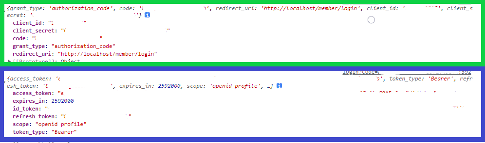

# 我的工作歷程
※這裡將會記錄我工作中所學所做的，不定期持續更新中...
## 前言
上了職訓局的轉職課程後，對前端HTML、CSS、Javascript以及後端PHP、SQL有基本的能力，大約一個月找到了第一份轉職的工作，這家公司是幫客戶做網站開發、SEO及在linux伺服器測試-上架，還有一些是做網站爬蟲、動畫設計、網頁設計等等工作，而我是做後端php的開發及維護的工作。以下是我在工作上所學到的及所做的事。

## 開發工具
<ol>
<li><a href="https://www.jetbrains.com/phpstorm/">PhpStorm</a></li>
<li><a href="https://code.visualstudio.com/">Visual Studio Code</a></li>
</ol>
目前主要是用這2個開發工具，PhpStorm主要是用在以php框架開發及維護使用；而Visual Studio Code則是用在前端HTML、CSS、Javascript以及原生php上。

## 使用框架
<ol>
<li><a href="https://laravel.com/">Laravel</a> 版本9</li>
<li><a href="https://codeigniter.tw/">CodeIgniter</a> 版本3</li>
</ol>
Laravel做專案開發；CodeIgniter做舊專案的維護。Laravel在MVC架構上比CodeIgniter嚴謹但語法上給我簡潔有力的感覺；CodeIgniter雖然也是MVC架構但感覺起來php語法比較偏向原生語法。

## 其他工具
<ol>
<li><a href="https://www.apachefriends.org/zh_tw/index.html">XAMPP</a> : 建置Apache、PHP及MariaDB環境的整合包，目前PHP8.1版本做開發；7.4、5.6版本作維護使用。依情況做版本切換。</li>
<li><a href="https://www.postman.com/">Postman</a> : API測試平台，建立好請求的URL和帶入的參數，測試是否成功送出請求及收到回傳資料是否符合規定的格式。</li>
<li><a href="https://www.sourcetreeapp.com/">Sourcetree</a> : 管理專案各分支，目前主要用來做分支merge使用。</li>
<li><a href="https://www.putty.org/">PuTTY</a> : 使用SSH連線方式連結Linux伺服器，建立測試網站，在網站正式上線前檢查是否有BUG問題、上線網站SSL更新等等...</li>
<li><a href="https://www.heidisql.com/">HeidiSQL</a> : 管理線上網站的資料庫，手動或輸入指令來做增刪查改或是備份資料庫的資料。</li>
<li><a href="https://filezilla-project.org/">FileZilla</a> : 用來更動伺服器上的檔案。</li>
<li><a href="https://gitlab.com/">GitLab</a> : 公司新舊專案放置管理的地方。</li>
</ol>

## 展示區
<ol>
<h3><strong>電子信箱驗證</strong></h3>
<ul>
使用框架:laravel 9<br>
功能需求:建立一個輸入欄位可以輸入一個或多個email，送出驗證時需各別驗證每個email是否重複及格式是否正確。<br>
* * *<br>
首先，一般email驗證會如以下這樣:

```php
    public function rules()
    {
        return [
            'email' => 'required|email',
        ];
    }
```

因為預設的驗證模式只能對單一的email字串做驗證，多筆email組成的字串無法直接使用，所以只能透過自訂規則的方式，先把字串拆開成一個一個email的陣列，才能去驗證每個email是否重複及格式是否正確。如以下程式碼所示:

```php
class Emailsvalid implements InvokableRule
{
    /**
     * Run the validation rule.
     *
     * @param  string  $attribute
     * @param  mixed  $value
     * @param  \Closure(string): \Illuminate\Translation\PotentiallyTranslatedString  $fail
     * @return void
     */
    public function __invoke($attribute, $value, $fail)
    {
        $emails = Setup::find(1)->toArray(); //抓取資料庫的email資料
        $strings['email'] = explode(',',$value); //輸入的多筆資料以「，」分開
        $strings2 = explode(',',$emails['email_address']); //資料庫的email資料以「，」分開

        foreach ($strings2 as $string2){ //資料庫的email資料分別對照輸入的資料是否重複
            if(in_array($string2,$strings['email'])){
                $fail($string2.'已經存在請重新填寫!!');
            }
        }

        //將處理好的資料作驗證
        Validator::make($strings, [
            'email' => 'required|array',
            'email.*' => 'required|email',
        ])->validate();

    }
}
```

寫好後引入到原本的Request檔案:

```php
public function rules()
    {
            return [
                'email_address' => ['required','string',new Emailsvalid],
            ];
    }
```

</ul>
<hr>
<h3><strong>資料庫塞入初始資料</strong></h3>
<ul>
測試程式時有時會塞一些資料進資料庫以利測試，若一筆一筆輸入較浪費時間，所以可以利用撰寫Seeder的方式來填充資料。<br>
使用框架:laravel 9<br>
* * *<br>

假設我想要生產1萬筆的資料可以這樣做:<br>
ArticleFactory:

```php
class ArticleFactory extends Factory
{
    /**
     * Define the model's default state.
     *
     * @return array<string, mixed>
     */
    public function definition()
    {
        return [
            'title' => fake()->name(),
            'textarea' => fake()->name(),
        ];
    }
}
```

ArticleSeeder:

```php
class ArticleSeeder extends Seeder
{
    /**
     * Run the database seeds.
     *
     * @return void
     */
    public function run()
    {
        Article::factory()->count(10000)->create();
    }
}
```

然後執行artisan指令，不過這樣還無法成功執行，因為要先在DatabaseSeeder檔案中 call ArticleSeeder 才能成功執行:

```php
class DatabaseSeeder extends Seeder
{
    public function run()
    {
        $this->call([
            ArticleSeeder::class,
        ]);
    }
}
```

</ul>
<hr>
<h3><strong>設計API</strong></h3>
<ul>
使用框架:laravel 9<br>
功能需求:和前端工程師討論並設計出部落格文章列表的API。<br>
* * *<br>
首先把需要用到的資料撈出來並依照API格式需求把資料處理好:

```php
private function getData()
    {   //撈取文章資料
        $articles = Article::select('articles.id', DB::raw('`articles`.`title` as name'), 'article_categorymappings.category_id', 'articles.created_at', 'articles.updated_at','articles.textarea','articles.uploadfile','articles.home_show','articles.home_show_time')
            ->leftJoin('article_categorymappings', 'articles.id', '=', 'article_categorymappings.article_id')->where('article_categorymappings.deleted_at',null)
            ->orderBy('articles.id', 'desc')->get()->toArray();
        $id = array_column($articles,'id'); //將文章的id值拉出來組成陣列
        //拉出標籤列表所有資料
        $tags = ArticleTag::select('articletagmappings.article_id','articletags.id','articletags.tagname')
                        ->rightJoin('articletagmappings','articletags.id','=','articletagmappings.tag_id')
                        ->where('articletagmappings.deleted_at',null)
                        ->whereIn('articletagmappings.article_id',$id)
                        ->orderBy('articletagmappings.article_id','desc')
                        ->get()->toArray();
        $tag = array_column($tags,'article_id'); //將文章標籤的article_id值拉出來組成陣列

              return collect($articles)->map(function ($data, $index) use($tag,$tags){
                  $removetags = strip_tags($data[ 'textarea' ]); //將textarea中的所有標籤去除成純文字
                  $key = array_keys($tag,$data['id']); //回傳對應id值的key
                  $reptag = [];
                foreach ($key as $row){
                    unset($tags[$row]['article_id']); //去除欄位article_id
                    $reptag[] = $tags[$row]; //寫入key值對應到的id,tagname
                }
                return [
                    'id'                  => $data['id'],
                    'home_show'           => $data['home_show'],
                    'home_show_time'      => $data['home_show_time'],
                    'name'                => $data[ 'name' ],
                    'category_id'         => $data[ 'category_id' ],
                    'created_at'          => $data[ 'created_at' ],
                    'updated_at'          => $data[ 'updated_at' ],
                    'image'               => $data[ 'articlePic' ]['url'] ?? "",
                    'summary'             => mb_substr($removetags,0,20,"utf-8")."...",
                    'description'         => $data[ 'textarea' ],
                    'tags'                => $reptag,
                    'download'            => $data[ 'uploadfile' ],
                ];
            })->toArray();
    }
```

再來依照討論好要用的參數條件篩選出資料:

```php
public function blogs(Request $request)
    {
        $typeID = $request->get('type_id');
        $tagID  = $request->get('tag_id');
        $home_show = $request->get('home_show');
        $page    = $request->get('page') ?? 1;
        $perPage = $request->get('per_page') ?? 20;
        $data = $this->getData(); //將處理好的資料帶進來
        $collection = collect($data);
        $data = $collection->filter(function ($item) use ($typeID, $tagID, $home_show) {
             //如果 Type id 跟 Tag id 沒有值代表要回傳全部的資料
            if (!$typeID && !$tagID && !$home_show) {
                return TRUE;
            }
            // 兩個都傳
            if ($typeID && $tagID) {
                $isMatch   = $item[ 'category_id' ] === (int)$typeID;
                $isContain = collect($item[ 'tags' ])->contains('id', (int)$tagID);
                return $isMatch && $isContain;
            }

            if ($typeID) { //篩選出指定類別id的文章資料
                return $item[ 'category_id' ] === (int)$typeID;
            }

            if ($tagID) { //篩選出含有指定標籤id的文章資料
                return collect($item[ 'tags' ])->contains('id', (int)$tagID);
            }

            if ($home_show) { //篩選出要在首頁顯示的文章資料
                return $item[ 'home_show' ] === (int)$home_show;
            }

            return FALSE;
        })->values()->toArray();
        $count      = $collection->count(); //總計撈出來的文章筆數
        $arrayVar = [
            'total'        => $count,
            'per_page'     => $perPage,
            'current_page' => $page,
            'last_page'    => $count / $page,
            'from'         => $perPage * $page + 1,
            'to'           => $perPage * $page,
            'data'         => $data,
        ];
        if($typeID && $home_show || $tagID && $home_show){ //若首頁顯示及類別id或標籤id同時存在，則設定查詢失敗
            return self::jsonFail('失敗',422);
        }else{
            return self::jsonSuccess('成功', $arrayVar);
        }
    }
```

最後利用Postman查看API格式是否符合需求:<br>


</ul>
<hr>
<h3><strong>第三方登入</strong></h3>
<ul><strong>* Google登入</strong><br>
利用官方文件的解說先在 <a href="https://console.cloud.google.com/">Google Cloud Platform</a> 建立API服務專案，然後利用javascript去撈取google會員資料。<br>
* * *<br>
建立登入按鈕及資料屬性:

```html
                <!-- XXX依照實際client_id做填寫 -->
                <div id="g_id_onload"
                     data-client_id="XXX.apps.googleusercontent.com" 
                     data-callback="handleCallback"
                     data-auto_prompt="false"
                >
                </div>
                <div class="g_id_signin"
                     data-type="standard"
                     data-size="large"
                     data-theme="outline"
                     data-text="sign_in_with"
                     data-shape="rectangular"
                     data-logo_alignment="left">
                </div>
```

<br>
<br>
建立google api script，接收回傳值(綠框)並做解碼撈取資料(藍框):

```javascript
//google api script
<script src="https://accounts.google.com/gsi/client" async defer></script>

<script>
    function parseJwt (token) { //JWT Token 解碼函式
        var base64Url = token.split('.')[1];
        var base64 = base64Url.replace(/-/g, '+').replace(/_/g, '/');
        var jsonPayload = decodeURIComponent(atob(base64).split('').map(function(c) {
            return '%' + ('00' + c.charCodeAt(0).toString(16)).slice(-2);
        }).join(''));

        return JSON.parse(jsonPayload);
    };
    function handleCallback(response) { //撈取回傳值並將credential欄位做解碼
        const data = parseJwt(response.credential);
        console.log(response);
        console.log(data);
    }
</script>
```

<br>
</ul>
<ul><strong>* Line登入</strong><br>
登入 <a href="https://developers.line.biz/zh-hant/">LINE Developers</a> 建立new channel ，建立完畢即可撰寫串接Line API的程式碼。<br>
* * *<br>
建立登入按鈕:

```html
<button id="lineLoginBtn" class="formBtnReset">LINE 登入</button>
```

<br>
<br>
成功登入後會拿到包含 code 的 token (下圖綠框):

```javascript
<script>
    //第一步:點擊按鈕 > 會員登入撈取code(token)
    $('#lineLoginBtn').on('click', function (e) {
        let client_id = 'XXX'; //XXX依照實際使用的client_id填寫
        let redirect_uri = 'http://localhost/member/login';
        let link = 'https://access.line.me/oauth2/v2.1/authorize?';
        link += 'response_type=code';
        link += '&client_id=' + client_id;
        link += '&redirect_uri=' + redirect_uri;
        link += '&state=XXX';
        link += '&scope=openid%20profile';
        window.location.href = link;
    });
</script>
```

再次請求第二次API帶入 code 參數撈取 access_token (下圖藍框):

```javascript
<script>
    const urlParams = new URLSearchParams(window.location.search);
    if (urlParams.has('state') && urlParams.has('code')) {
        let state = urlParams.get('state');
        let code = urlParams.get('code');
        if (state === 'XXX') {
            //第二步:使用第一步撈取的token及其他參數來請求access_token
            let url = new URL('https://api.line.me/oauth2/v2.1/token');
            let urlBody = { //網址要帶的參數
                        grant_type: 'authorization_code',
                        code: code, //第一步撈取的token
                        redirect_uri: 'http://localhost/member/login',
                        client_id: 'XXX', //依照實際使用的client_id填寫
                        client_secret: 'XXX', //依照實際使用的client_secret填寫
            };

            $.ajax({
                    type: "post",
                    url: url,
                    data: urlBody,
                    success:function(res){
                        let myObj = res;
                        console.log(myObj);
                        let accToken = myObj.access_token; //撈取回傳的access_token
                        console.log(accToken);
                    },
                    error:function(err){console.log(err)},
                });
            }
        }
</script>
```

<br>
此 access_token 即可傳送到後端，由後端來依此 access_token 來做會員註冊存取等動作。
</ul>
<hr>


    


